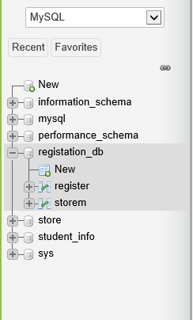
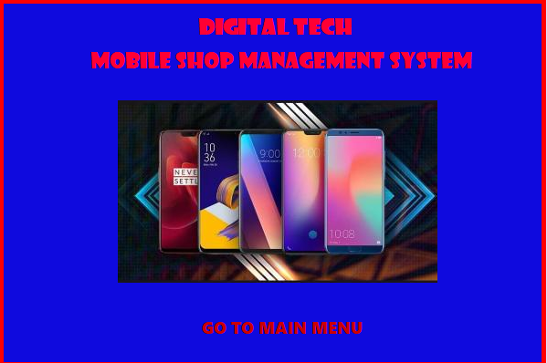
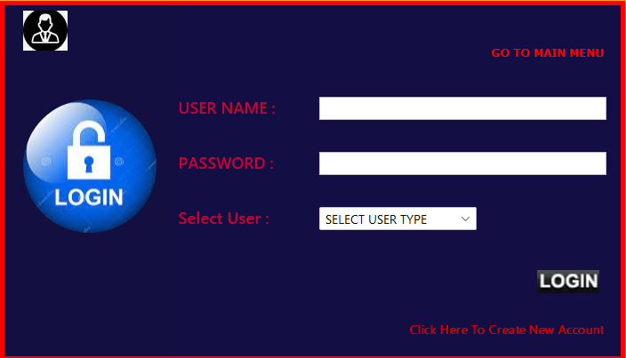
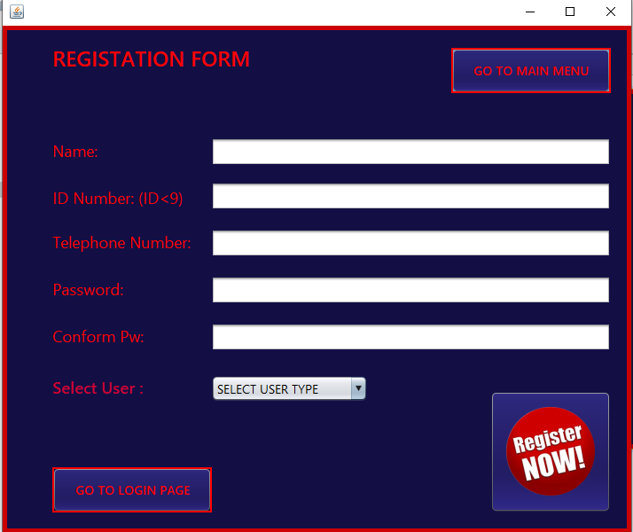
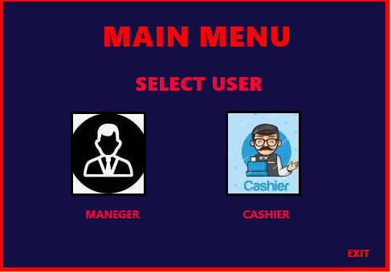
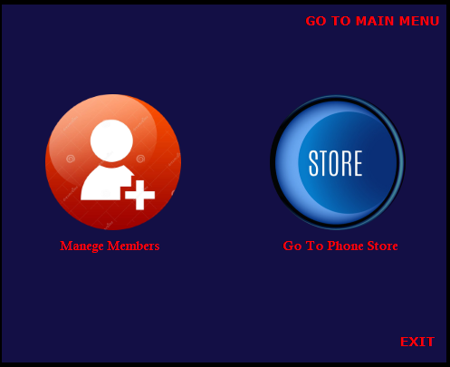

<h1>Phone-Shop JAVA Project-NETBEANS</h1>
<h4>using JAVA AND MYSQL</h4>

<h2>Introduction this project</h2>
Creating a Java phone shop program is a comprehensive project that involves developing a software application to manage various aspects of a phone retail store. This program will help store owners and employees track inventory, manage sales, handle customer information, and perform other essential tasks related to running a phone shop. Below is a detailed description of the features and functionality you might consider including in your Java phone shop program.

<h2>Project GUI</h2>
1) Database Image 

2) Project GUI

3) Login form

4) Register form

